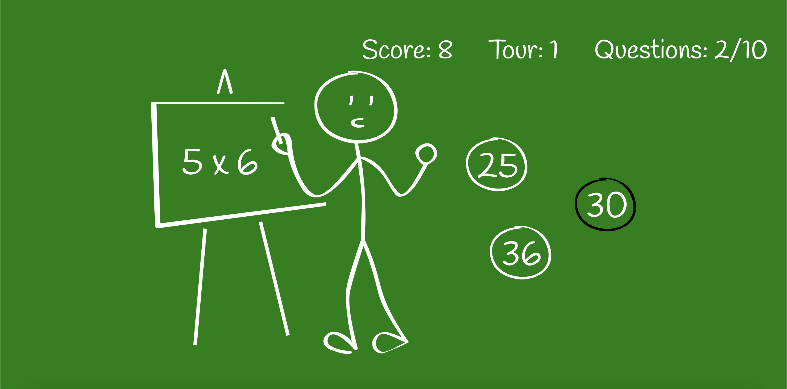

## patika react math-game project

### Introduction

My math-game project that I developed with React.

### Tools

* React
* UUID

### Deployment Link

### Setup

* Clone project to your computer git clone `https://github.com/yusufavcilar/react-tic-tac-toe`
* Install dependencies `npm install`
* Starting local server `npm run start`
  

### Contact

* <a href="mailto:yusufavcilar53@gmail.com" target="_blank">Email </a>
* [Twitter](https://twitter.com/yusufavcilarr)
* [Linkedin](https://www.linkedin.com/in/yusuf-avcilar/)
* [Github](https://github.com/yusufavcilar)

### Repository

### Licence

[MIT](LICENCE)